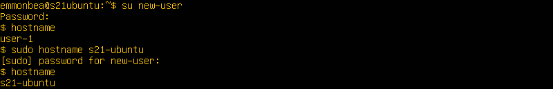
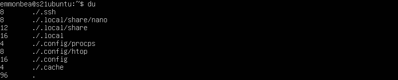

## Part 1. Установка ОС

1. Проверить версию Ubuntu: 
    

## Part 2. Создание пользователя

1. Создать пользователя и добавить его в группу adm: 
    
2. Вывести список пользователей (в конце): 
    

## Part 3. Настройка сети ОС

1. Задать имя машины вида user-1: 
    
2. Установить временную зону, соответствующую текущему местоположению, и вывести информации о времени: 
    
3. Установить набор сетевых интерфейсов: 
    
4. Вывести информацию о сетевых интерфейсах: 
    
   - **lo (loopback device)** - виртуальный интерфейс, присутствующий по умолчанию в любом Linux. Он используется для отладки сетевых программ и запуска серверных приложений на локальной машине. С этим интерфейсом всегда связан адрес 127.0.0.1. У него есть dns-имя – localhost. 
5. Получить ip-адрес устройства от DHCP сервера 
    
   - ip адрес устройства указан после **bound to** 
   - **DHCP** - Dynamic Host Configuration Protocol 
6. Получить внешний ip-адрес 
    
7. Вывести внутренней адрес шлюза (ip-адрес по умолчанию) 
    
8. Задать статичные настройки ip, gw, dns 
    
9. Применить изменения в netplan и перезагрузиться 
    
10. Проверить соответствия адресов адресам, указанным в предыдущем пункте 
     
11. Пропинговать удаленные хосты 1.1.1.1 и ya.ru 
     

## Part 4. Обновление ОС

1. Обновить системные пакеты до последней на момент выполнения задания версии 
    

## Part 5. Использование команды sudo

1. **sudo** - позволяет временно поднимать привилегии и выполнять команды администрирования с максимальными правамии. 
2. Добавить пользователя, созданного в Part 2, в группу с привилегиями sudo 
    
3. Поменять hostname ОС от имени пользователя, созданного в пункте Part 2 (используя sudo). 
    

## Part 6. Установка и настройка службы времени

1. Вывести время часового пояса 
    
2. Вывод команды timedatectl show 
    

## Part 7. Установка и использование текстовых редакторов

1. Сохранить никнейм 
   1. **VIM** - для записи никнейма необходимо войти в режим вставки ("I"). Для сохранения изменений, необходимо перейти в стандартный режим (ESC) и прописать :wq test_vim.txt. 
       
   2. **NANO** - для сохранения изменений необходимо нажать ^O, после чего ввести имя файла. Выйти с помощью ^X. 
       
   3. **JOE** - для сохранения изменений необходимо нажать :KX и ввести имя файла 
       
2. Заменить никнейм на строку "21 School 21", закрыть файл без изменений 
   1. **VIM** - для закрытия файла без изменений войти в стандартный режим (ESC) и прописать :q! 
       
   2. **NANO** - для закрытия файла без изменений ^X -> N  
       
   3. **JOE** - для закрытия файла без изменений ^C -> y 
       
3. Отредактировать файл, используя функции поиска по содержимому файла и замены слова на любое другое 
   1. **VIM** 
      - для поиска содержимого: /текст 
          
      - для замены: :s/текст для замены/замена 
          
   2. **NANO** 
      - для поиска содержимого: ^W -> текст 
          
      - для замены: : ^\ -> текст для замены -> замена -> Y 
          
   3. **JOE** 
      - для поиска содержимого: ^K F -> текст для замены -> I 
          
      - для замены: : ^K F -> текст для замены -> R -> замена -> Y 
          

## Part 8. Установка и базовая настройка сервиса SSHD

1. Установить пакет OpenSSH server: 
   `sudo apt install openssh-server` 
2. Добавить автостарт службы при загрузке системы: 
   `sudo systemctl start ssh` 
3. Проверить работоспособность утилиты: 
   `ssh localhost` 
4. Перенастроить службу SSHd на порт 2022 
   - Перед модификацией конфигурационного файла создать резеврную копию: 
     `sudo cp /etc/ssh/sshd_config /etc/ssh/sshd_config.factory-defaults` 
   - Открыть файл конфигурации: 
     `sudo vim /etc/ssh/sshd_config` 
   - Изменить порт на 2022: 
      
5. Используя команду ps, показать наличие процесса sshd: 
   `ps -ef | grep sshd` 
   **ps** - выводит список текущих процессов; 
   **-e** - выбрать все процессы; 
   **-f** - показывает полную информацию; 
   **grep ssh** - вывод процессов, которые содержат строку ssh; 
   **ps -ef | grep sshd** - показывает полную информацию по процессам, содержащим строку sshd; 
    
   Перезагрузить систему: 
   `sudo reboot`
6. Вывод команды netstat -tan: 
    
   **-tan**: 
   **-t** - отображать TCP подключения; 
   **-a** - показать состояние всех сокетов; 
   **-n** - показывать сетевые адреса как числа; 
   **Proto** - Содержит тип протокола 
   **Recv-Q** - Счётчик байтов не скопированных программой пользователя из этого сокета. 
   **Send-Q** - Счётчик байтов, не подтверждённых удалённым узлом. 
   **Local Address** - Адрес и номер порта локального конца сокета. 
   **Foreign Address** - Адрес и номер порта удалённого конца сокета. 
   **State** - Состояние сокета. 
   **LISTEN** Сокет ожидает входящих подключений. 
   **SYN_SENT** Сокет, находящийся в режиме активной попытки установки подключения. 
   **0.0.0.0** - это немаршрутизируемый адрес IPv4, который используется в качестве адреса по умолчанию или адреса-заполнителя.

## Part 9. Установка и использование утилит top, htop

1. Использовать утилиту **top**: 
   - uptime: 26 min; 
   - количество авторизованных пользователей: 1; 
   - общую загрузку системы: 0.00, 0.00, 0.00; 
   - общее количество процессов: 118; 
   - загрузку cpu: 0.0 us, 0.0 sy, 0.0 ni, 100.0 id, 0.0 wa, 0.0 hi, 0.0 si, 0.0 st; 
   - загрузку памяти: 7947.5 total, 7446.3 free, 166.4 used, 334.8 buff/cache; 
   - pid процесса занимающего больше всего памяти: 1; 
   - pid процесса, занимающего больше всего процессорного времени: 425; 

    

2. Использовать утилиту htop: 

   - отсортировать по PID: 
      
   - отсортировать по PERCENT_CPU: 
      
   - отсортировать по PERCENT_MEM: 
      
   - отсортировать по TIME: 
      
   - отсортировать для процесса sshd: 
      
   - процесс syslog, найденный через поиск: 
      
   - добавить вывод hostname, clock и uptime 
      

## Part 10. Использование утилиты fdisk

1. Запустить команду `sudo fdick -l` 
    

- Записать в отчете название жесткого диска, его размер и количество секторов, а также размер swap: Disk /dev/sda: 20 Gib, 2147836480 bytes, 41943040 sectors  

## Part 11. Использование утилиты df

1. Запустить команду `df`: 
    

   - размер раздела: 10218772 Кб; 
   - размер занятого пространства: 2725108 Кб; 
   - размер свободного пространства: 6952992 Кб; 
   - процент использования: 29%; 

2. Запустить команду `df -Th`: 
    
   - размер раздела: 9,8 Гб; 
   - размер занятого пространства: 2,6 Гб; 
   - размер свободного пространства: 6,7 Гб; 
   - процент использования: 29%; 
   - Тип файловой системы: ext4; 

## Part 12. Использование утилиты du

1. Запустить команду `du`. 
    
2. Вывести размер папок /home, /var, /var/log (в байтах, в человекочитаемом виде): 
   - `du -h /home`: 
      
   - `du -h /var`: 
      
   - `du -h /var/log`: 
      
3. Вывести размер всего содержимого в /var/log (не общее, а каждого вложенного элемента, используя \*) 
   - `du -h /var/log/*`: 
      

## Part 13. Установка и использование утилиты ncdu

1. Установить утилиту ncdu:
   - `sudo apt install ncdu` 
      
2. Вывести размер папок /home, /var, /var/log: 
   - `ncdu /home`: 
      
   - `ncdu /var`: 
      
   - `ncdu /var/log`: 
      

## Part 14. Работа с системными журналами

1. Последняя авторизация: 
    

2. Перезапуск OpenSSH Server: 
    

## Part 15. Использование планировщика заданий CRON

1. Используя планировщик заданий, запускать команду uptime через каждые 2 минуты: 

   `vim crontab -e` 

    

   - uptime каждые 2 минуты: 
      

2. Вывести список задач: 
   `crontab -l` 
    
3. Удалить все задания из планировщика заданий: 
   `crontab -r` 
4. Вывести список текущих задач: 
    
